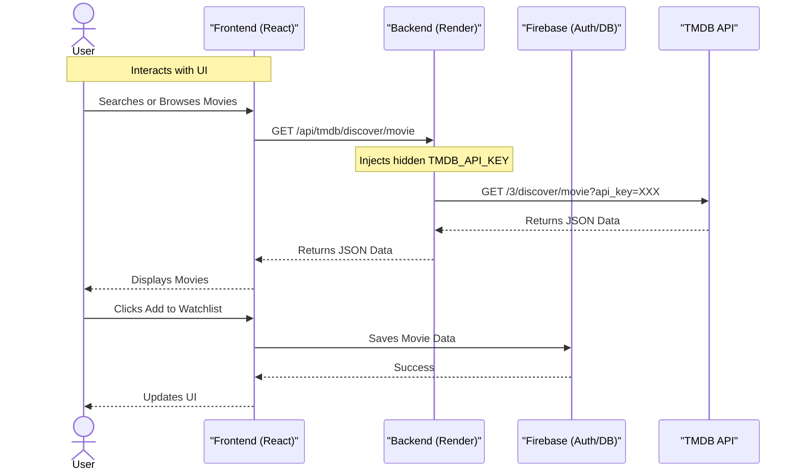

# 🎬 MovieTracker (Netflix Clone)


A full-stack Netflix-inspired movie discovery and tracking application. Built with React (Vite), Firebase, and a custom Node.js Express proxy backend to ensure seamless data fetching from the TMDB API.

---

## 🏗️ Architecture Overview

The application follows a decoupled client-server architecture. To overcome common ISP blocks on the TMDB API in regions like India, a custom Node.js reverse proxy acts as an intermediary between the React client and the TMDB servers. User data (like authentication and watchlists) is securely handled directly between the client and Firebase.



---

## ✨ Key Features

- **🔐 Secure Authentication:** Seamless sign-up and login utilizing Firebase Authentication (Email/Password & Google OAuth).
- **🎥 Extensive Movie Catalog:** Dynamic fetching of Top Rated, Upcoming, and Popular movies using the TMDB API.
- **♾️ Infinite Scrolling:** Smoothly loads more content automatically as the user scrolls down using the native `IntersectionObserver` API.
- **🔍 Advanced Search:** Fast and responsive search functionality to find specific movie titles.
- **📝 Personal Watchlist:** Users can add and manage their favorite movies. Data is persistently stored per user in Firebase Firestore.
- **🔀 Smart Sorting:** Organize the watchlist alphabetically (A-Z), in reverse order, or by the highest user ratings.
- **🛡️ ISP Block Bypass (Proxy Server):** A dedicated Node.js/Express backend handles all TMDB API calls to successfully bypass regional ISP restrictions.

---

## 🛠️ Technology Stack

### Frontend (Client)
- **Framework:** React 19 (via Vite)
- **Routing:** React Router DOM
- **Styling:** Vanilla CSS (Dark-themed, Netflix-inspired UI)
- **Hosting:** Firebase Hosting

### Backend (Proxy Server)
- **Runtime:** Node.js
- **Framework:** Express.js v5
- **Requests:** Axios
- **Hosting:** Render

### Database & Authentication (BaaS)
- **Provider:** Firebase
- **Services:** Firebase Auth, Firestore Database

---

## 🚀 Getting Started (Local Development)

Follow these steps to run both the frontend and backend locally.

### Prerequisites
- Node.js (v18+)
- Firebase Account (with a configured project for Auth & Firestore)
- TMDB (The Movie Database) API Key

### 1. Clone the Repository
```bash
git clone <your-repo-url>
cd netflix_clone_using_rct
```

### 2. Setup the Backend (Proxy)
The backend securely stores your TMDB API key and proxies requests to avoid ISP blocks.

```bash
cd backend
npm install
```

Create a `.env` file in the `backend` directory:
```env
TMDB_API_KEY=your_tmdb_v3_api_key_here
PORT=5000
```

Start the backend server:
```bash
npm start
```
*The server will run on `http://localhost:5000`*

### 3. Setup the Frontend
Open a new terminal window and navigate to the frontend directory.

```bash
cd frontend
npm install
```

Create a `.env` file in the `frontend` directory. Set `VITE_BACKEND_URL` to point to your local server:
```env
VITE_BACKEND_URL=http://localhost:5000/api/tmdb

# Add your Firebase configuration keys below:
VITE_apiKey=your_firebase_api_key
VITE_authDomain=your_firebase_auth_domain
VITE_projectId=your_firebase_project_id
VITE_storageBucket=your_firebase_storage_bucket
VITE_messagingSenderId=your_firebase_messaging_sender_id
VITE_appId=your_firebase_app_id
VITE_measurementId=your_firebase_measurement_id
```

Start the React development server:
```bash
npm run dev
```
*The frontend will run on `http://localhost:5173`*

---

## 🌍 Deployment Guide

### Deploying the Backend (Render)
1. Push your codebase to a public GitHub repository.
2. Go to your Render Dashboard and create a new **Web Service**.
3. Connect your repository and strictly set the **Root Directory** to `backend`.
4. Set the Build Command to `npm install` and Start Command to `npm start`.
5. Under **Environment Variables**, add a new key `TMDB_API_KEY` and paste your actual TMDB key.
6. Deploy and copy your live URL (e.g., `https://movie-tracker-backend.onrender.com`).

### Deploying the Frontend (Firebase Hosting)
1. In your local `frontend/.env` file, update the `VITE_BACKEND_URL` with your new live Render URL:
   ```env
   VITE_BACKEND_URL=https://movie-tracker-backend.onrender.com/api/tmdb
   ```
2. Build the production application:
   ```bash
   cd frontend
   npm run build
   ```
3. Deploy to Firebase:
   ```bash
   firebase deploy
   ```

---

## 📁 Project Structure

```text
📦 netflix_clone_using_rct
 ┣ 📂 backend/               # Node.js Proxy Server
 ┃ ┣ 📜 server.js            # Express API setup & endpoints
 ┃ ┣ 📜 package.json         # Backend dependencies
 ┃ ┗ 📜 .env                 # (Ignored) TMDB API Key
 ┣ 📂 frontend/              # React Application
 ┃ ┣ 📂 src/
 ┃ ┃ ┣ 📂 components/        # Reusable UI (Sidebar, MovieCard, Nav)
 ┃ ┃ ┣ 📂 pages/             # App views (Home, Login, Search, Watchlist)
 ┃ ┃ ┣ 📂 config/            # Firebase initialization logic
 ┃ ┃ ┣ 📜 App.jsx            # React Router setup
 ┃ ┃ ┗ 📜 index.css          # Global styling
 ┃ ┣ 📜 firebase.json        # Firebase Hosting config
 ┃ ┣ 📜 vite.config.js       # Vite configuration
 ┃ ┗ 📜 .env                 # (Ignored) Firebase Keys & Backend URL
 ┗ 📜 .gitignore             # Root gitignore rules
```

## 📜 License
This project is open-source and available under the MIT License.
